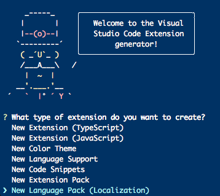

# Visual Studio Code Language Packs

This repository contains all of the localized Language Pack extensions for Visual Studio Code. A Language Pack contains the localized string resources for a particular language. 

Localized resource files are managed in [Transifex](https://www.transifex.com/microsoft-oss/).

There are 9 "core" languages for Visual Studio Code and, currently, 4 addtional, community driven languages:  

|Language|VS Code LanguageID|Transifex LanguageCode|Type|
|--------|--------|--------|--------|
|**French**|fr|French (fr)|Core
|**Italian**|it|Italian (it)|Core
|**German**|de|German (de)|Core
|**Spanish**|es|Spanish (es)|Core
|**Russian**|ru|Russian (ru)|Core
|**Chinese (Simplified)**|zh-cn|Chinese Simplified (zh-Hans) |Core
|**Chinese (Traditional)**|zh-tw|Chinese Traditional (zh-Hant) |Core
|**Japanese**|ja|Japanese (ja)|Core
|**Korean**|ko|Korean (ko)|Core
|**Bulgarian**|bg|Bulgarian (bg)|Community
|**English (United Kingdom)**|en-GB|English (en-GB)|Community
|**Hungarian**|hu|Hungarian (hu)|Community
|**Portugese (Brazil)**|pt-br|Portuguese (Brazil) (pt_BR) |Community
|**Turkish**|tr|Turkish (tr)|Community

Language pack extensions are published to the [VS Code Marketplace](https://marketplace.visualstudio.com/VSCode)

## Creating a Language Pack

* Install the next version of the VS Code yeoman generator

``` bash
npm install -g generator-code@next
```

Create a new Language Pack by running `yo code` and choosing `New Language Pack (Localization)`:

``` bash
yo code
```



After answering the prompts, you will have a new folder called `vscode-language-pack-[language code]` containing all the files you need to get started with the extension.

You will use a script from the VS Code repostiory to generate the translations, so we need to clone that repository (see [Contributing to Code](https://github.com/Microsoft/vscode/wiki/How-to-Contribute#build-and-run-from-source) for more information).

``` bash
git clone https://github.com/microsoft/vscode
cd vscode
yarn 
```

Now, download the language files from Transifex and generate the translations:

* Get a Transifex API token from [https://www.transifex.com/user/settings/api](https://www.transifex.com/user/settings/api) that has access to projects `vscode-editor`, `vscode-workbench` and `vscode-extensions`.
* Set the API token to the environment variable `TRANSIFEX_API_TOKEN`.
* run the `update-localization-extension` script from VS Code:

``` bash
export TRANSIFEX_API_TOKEN=<<< Transifex Token >>>
npm run update-localization-extension {path_to_lang_pack_ext}
```

This will add new files to `path_to_lang_pack_ext/translations` and will add a list of paths to the translations to `package.json`. You can now build and test your extension.

You can now build and test your extension.

``` bash
cd [path to your extension]
vsce package
code --install-extension [name of your extension.vsix]
code --locale [the new locale id, e.g. tr]
```

## Contributing Translations

VS Code translations are done in the [VS Code Project in Transifex](https://aka.ms/vscodeloc). Transifex is the single source of "truth", therefore any changes need to be made there. This repository is for building the language pack extensions.

## Issue Reporting

If you want to give feedback or report issue, please create a [new GitHub issue](https://github.com/Microsoft/vscode-loc/issuesnew). Please check if a topic about your issue already exists!).

## Legal
Before we can accept your pull request you will need to sign a **Contribution License Agreement**. All you need to do is to submit a pull request, then the PR will get appropriately labelled (e.g. `cla-required`, `cla-norequired`, `cla-signed`, `cla-already-signed`). If you already signed the agreement we will continue with reviewing the PR, otherwise system will tell you how you can sign the CLA. Once you sign the CLA all future PR's will be labeled as `cla-signed`.

# Microsoft Open Source Code of Conduct

This project has adopted the [**Microsoft Open Source Code of Conduct**](https://opensource.microsoft.com/codeofconduct/).
For more information see the [**Code of Conduct FAQ**](https://opensource.microsoft.com/codeofconduct/faq/) or
contact [**opencode@microsoft.com**](mailto:opencode@microsoft.com) with any additional questions or comments.

## License 
[MIT](LICENSE.md)
